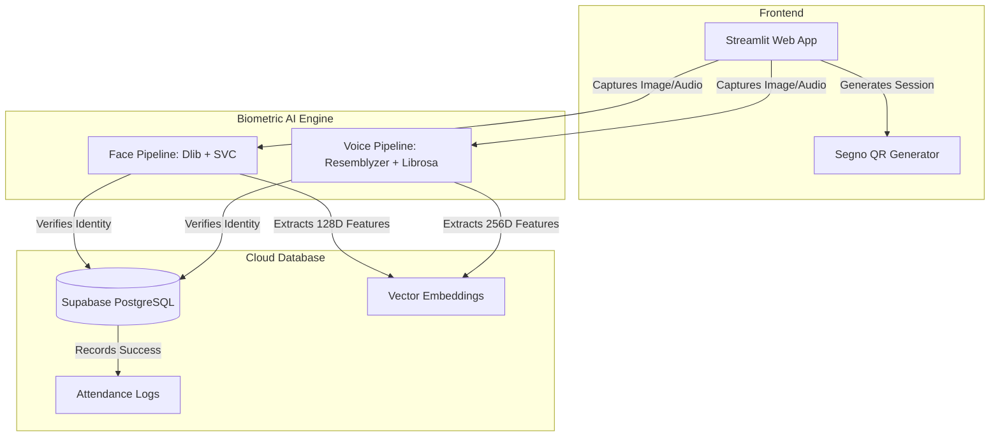
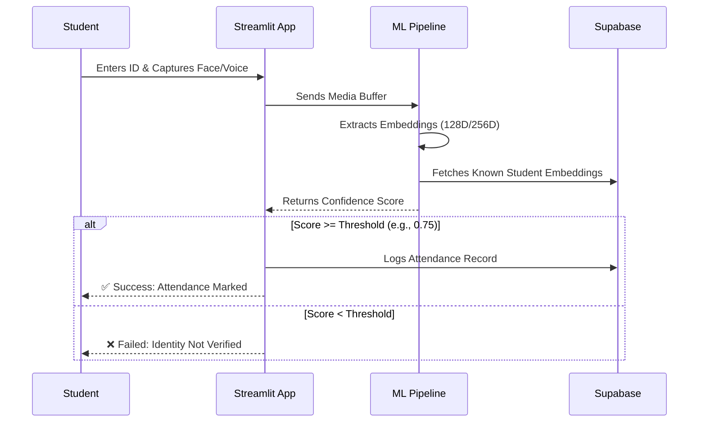

# 📸 SnapClass: AI-Powered Biometric Attendance System

SnapClass is a multi-modal, AI-powered classroom attendance application. It leverages facial recognition and voice biometrics to securely and efficiently log student attendance, replacing traditional roll calls with a seamless Streamlit interface.

## 🚀 Features
* **Multi-Role Dashboards:** Distinct routing and UI flows for Students and Teachers.
* **Facial Biometrics:** Uses `dlib` (68-point shape predictor & 128D ResNet descriptor) and a Scikit-Learn Linear SVC for multi-face recognition.
* **Voice Biometrics:** Uses `librosa` for Voice Activity Detection (VAD) and `resemblyzer` for 256D voice embedding extraction and cosine-similarity matching.
* **Cloud Database:** Integrated with Supabase (PostgreSQL) for student CRUD, subject enrollments, and attendance logging.
* **Dynamic QR Codes:** Teachers can generate session-specific QR codes for students to scan and join.

## 🛠️ Technology Stack
* **Frontend:** Streamlit, Segno (QR generation)
* **Computer Vision:** OpenCV, Dlib, Scikit-Learn
* **Audio Processing:** Librosa, Resemblyzer
* **Database & Auth:** Supabase Python SDK

## 📂 Project Architecture


## 🧠 System Architecture



## 🔄 Biometric Verification Flow



```text
snapclass/
├── app.py                              # Main Streamlit application & router
├── requirements.txt                    # Python dependencies
├── .env                                # Supabase credentials (ignored in git)
├── models/                             # Dlib model weights (ignored in git)
└── src/
    ├── components/
    │   └── ui_components.py            # Streamlit modal dialogs & QR rendering
    ├── database/
    │   └── db.py                       # Supabase abstraction layer
    └── pipelines/
        ├── face_pipeline.py            # Dlib + SVC facial recognition engine
        └── voice_pipeline.py           # Resemblyzer audio processing engine


