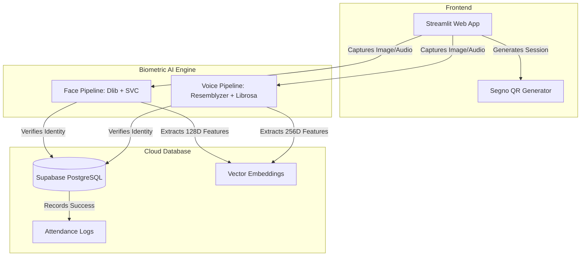
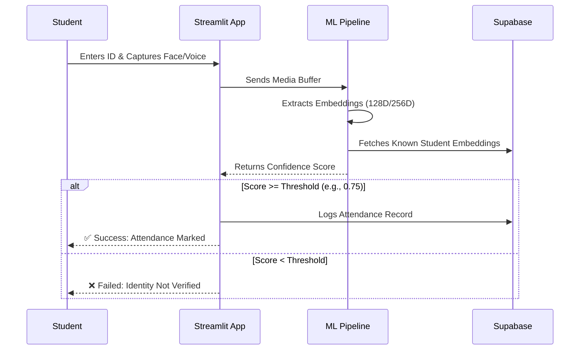

# 📸 SnapClass: AI-Powered Biometric Attendance System

Hi! 👋 I built this project to explore how Machine Learning and Computer Vision can solve real-world administrative problems, specifically, the time wasted on manual classroom roll calls. 

SnapClass is a proof-of-concept web app that uses facial recognition and voice biometrics to securely log student attendance. Building this allowed me to dive deep into integrating ML models with web frameworks and cloud databases.

## 🚀 Features
* **Multi-Role Dashboards:** Distinct routing and UI flows for Students and Teachers.
* **Facial Biometrics:** Uses `dlib` (68-point shape predictor & 128D ResNet descriptor) and a Scikit-Learn Linear SVC for multi-face recognition.
* **Voice Biometrics:** Uses `librosa` for Voice Activity Detection (VAD) and `resemblyzer` for 256D voice embedding extraction and cosine-similarity matching.
* **Cloud Database:** Integrated with Supabase (PostgreSQL) for student CRUD, subject enrollments, and attendance logging.
* **Dynamic QR Codes:** Teachers can generate session-specific QR codes for students to scan and join.

## 🛠️ Technology Stack
* **Frontend:** Streamlit, Segno (QR generation)
* **Computer Vision:** OpenCV, Dlib, Scikit-Learn
* **Audio Processing:** Librosa, Resemblyzer
* **Database & Auth:** Supabase Python SDK

## 🧠 What I Learned & Challenges Faced
As a recent graduate, building this end-to-end pipeline taught me a lot:
* **Handling Streamlit Session State:** I initially struggled with the camera and audio inputs resetting the app. I learned how to use `st.session_state` to persist the captured media across reruns.
* **Audio Preprocessing:** Raw audio from a laptop mic is noisy. I had to learn how to use `librosa` to apply Voice Activity Detection (VAD) to trim silence before feeding it to the Resemblyzer model.
* **Model Trade-offs:** I chose a Scikit-Learn Linear SVC over a deep neural network for the final classification step because it trains much faster on small datasets (like a classroom of 30 students) without overfitting.

## 🚧 Known Limitations & Future Work
Since this is a portfolio project, there are a few things I would improve in a production environment:
1. **Liveness Detection:** Currently, the system could be fooled by holding up a photo to the camera. I would like to add blink detection or depth-sensing in the future.
2. **Background Noise:** The voice biometrics struggle in a noisy classroom environment. Implementing a noise-reduction filter before embedding extraction would improve accuracy.
3. **Database Security:** Biometric embeddings are currently stored as raw float arrays. In a real app, these would need strict encryption and compliance with data privacy laws (like GDPR).

## 📂 Project Architecture


## 🧠 System Architecture



## 🔄 Biometric Verification Flow



```text
snapclass/
├── app.py                              # Main Streamlit application & router
├── requirements.txt                    # Python dependencies
├── .env                                # Supabase credentials (ignored in git)
├── models/                             # Dlib model weights (ignored in git)
└── src/
    ├── components/
    │   └── ui_components.py            # Streamlit modal dialogs & QR rendering
    ├── database/
    │   └── db.py                       # Supabase abstraction layer
    └── pipelines/
        ├── face_pipeline.py            # Dlib + SVC facial recognition engine
        └── voice_pipeline.py           # Resemblyzer audio processing engine


